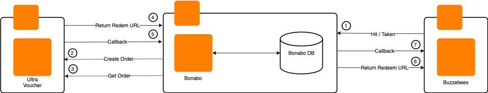
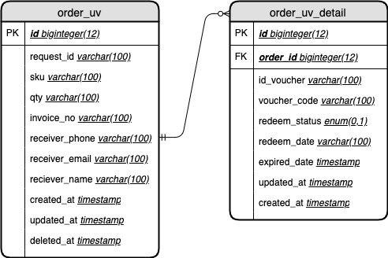

= Bonabo for Ultra Voucher Bonabo

For support Buzzebees (apps for sales XL), we need revamp and cutting several flow for support voucher from Ultra Voucher.

== High Level Diagram

Flow HLA Bonabo, Ultra Voucher, and BZB :

. Buzzebees hit or taken to Bonabo
. Bonabo create order to Ultra Voucher
. Bonabo get order to Ultra Voucher
. Ultra Voucher sent Redeem URL to Bonabo
. Ultra Voucher sent callback to Bonabo
. Bonabo sent back return redeem url from Ultra Voucher to Buzzebees
. Bonabo sent callback to Buzzebees

== ERD for Support Ultra Voucher

Add ERD for support ultra voucher, we must add 2 table (*order_uv*, and *order_uv_detail*)

Untuk credential database Bonabo, dapat diakses pada link di bawah ini :

Untuk mengakses database, Anda dapat menghubungi Development Team Bonabo

== Swagger

Swagger for Bonabo is not changed, but some values in parameter will be available for endpoint */token*, field parameter *token* can be filled by *id_voucher* (given from response Ultra Voucher)

== Ultra Voucher

Ultra Voucher detail flow and API can be check in here :

Untuk mengakses database, Anda dapat menghubungi Development Team Bonabo
