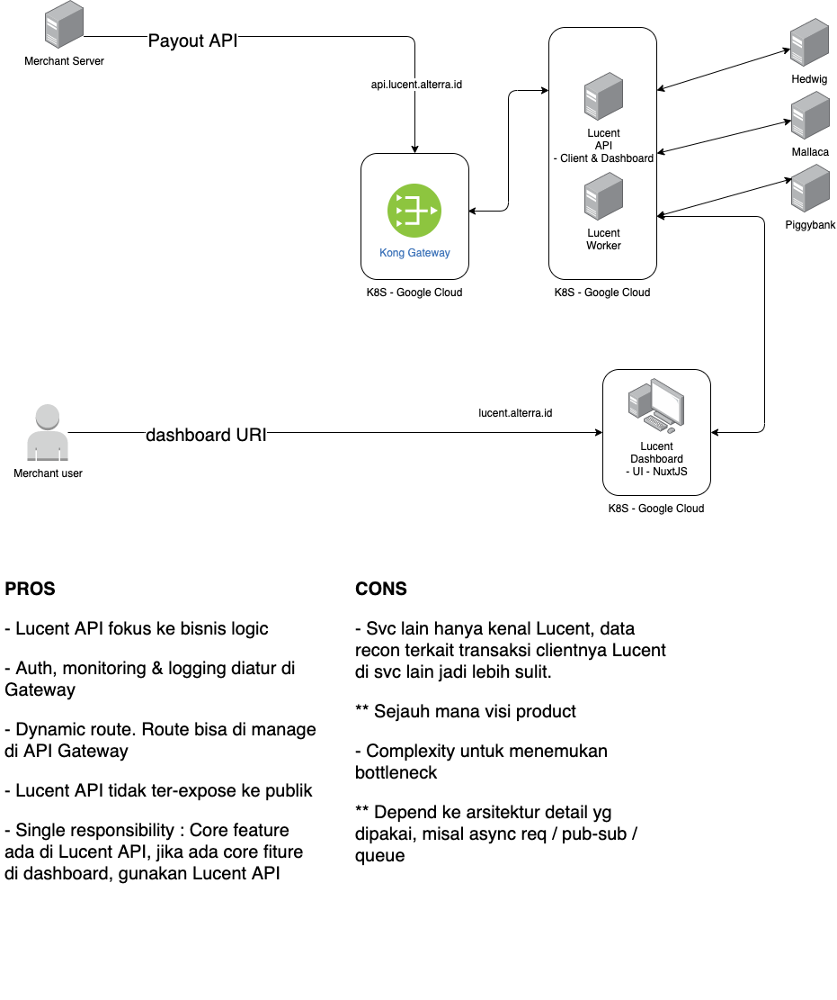

= Arsitektur Lucent

== High Level Architecture

Berikut adalah gambar dari _High Level Architecture_ (HLA) Lucent :

=== Notes

. Merchant Server _request_ Payout API _via_ HTTP API ke Lucent API melalui endpoint URI yang sudah di-_routing_ oleh Kong Gateway.
. Merchant User _request_ melalui Lucent Dashboard via dashboard URI (tidak di-_routing_ oleh Kong Gateway).
. Lucent Dashboard melakukan koneksi langsung ke Lucent API melalui endpoint URI yang ada (tidak di-_routing_ oleh Kong Gateway).
. Lucent API akan meneruskan _job_ sesuai dengan fungsinya, disburse (Mallaca), send notif (Hedwig), dan deposit (Piggybank).

== Related System

|===
| Nama Sistem | Deskripsi

| Odoo (ERP)
| Sistem aplikasi manajemen bisnis yang mengelola keuangan dan pelaporan ke STI

| Hedwig
| Sistem notifikasi di Sepulsa

| Disbursment
| Sistem yang menangani pembayaran _merchant_ ke semua akun bank

| Piggy Bank
| Sistem yang mengelola Deposit di produk Sepulsa.
|===
