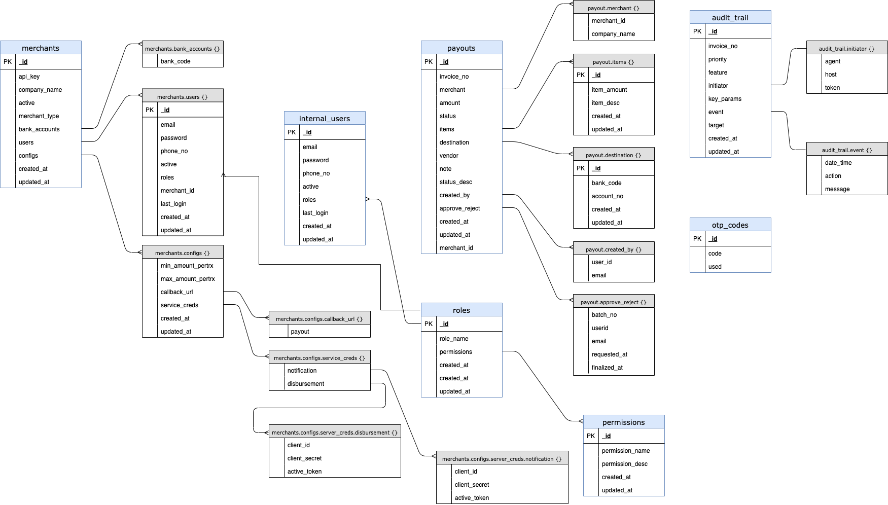

= Database Lucent

== Entity Relationship Diagram (ERD)

=== Details

1. merchants
  .. _id: objectID
  .. api_key: string(50)|unique_idx
  .. company_name: string(50)
  .. active: int[10]
  .. merchant_type: string["fasilitator"|"aggregator"]
  .. bank accounts
    ... bank_code: string
  .. users
    ... _id: objectID
    ... email: string|unique_idx|required
    ... phone_no: string|unique_idx|required
    ... password: string| hashed
    ... active: int|[1,0]|default:1
    ... roles
      .... role_id: objectID
    ... merchant_id: objectID
    ... last_login: timestamp
    ... created_at: timestamp
    ... updated_at: timestamp
  .. configs
    ... min_amount_pertrx: double
    ... max_amount_pertrx: double
    .... callback_url
      ..... payout: string
    .... service_creds
      ..... Notification
      ...... client_id: string(50)
      ...... client_secret: string(50)
      ...... active_token: string(50)
      ..... Disbursement
      ...... client_id: string(50)
      ...... client_secret: string(50)
      ...... active_token: string(50)
    ... created_at: timestamp
    ... updated_at: timestamp
. internal_users
  .. _id: objectID
  .. email: string(50)|unique_idx|required
  .. mobileno: string | unique_idx | required
  .. password: string | hashed
  .. active: int | [1,0] | default:1
    ... roles
      .... role_id: objectID | ref_from:roles._id
  .. last_login: timestamp
  .. created_at: timestamp
  .. updated_at: timestamp
. permissions
  .. _id: objectID
  .. permission_name: string(255) | unique_idx | lowercase
  .. permission_desc: string(255)
  .. created_at: timestamp
  .. updated_at: timestamp
. roles
 .. _id: objectID
 .. role_name: string | unique_idx | lowercase
    ... permissions
      .... permission_id objectid | ref_from:permissions._id
  .. created_at: timestamp
  .. updated_at: timestamp
. payout
  .. _id: objectID
    ... merchant
    .... merchant_id: objectID
    .... Company_name: string(50)
  .. invoice_no: string(50)
  .. amount: double
  .. status: string | [ "draft_0", "draft_1", "approved", "reject", "success", "failed", "expired" ]
    ... items
   .... item_amount: double
   .... item_desc: string(255)
  .. bank_code: string (source bank_code)
  ... destination
   .... general_bank_code: string (local bank code or swift)
   .... account_no: string
 .. vendor: string
 .. notes: string
 .. status_desc: string
  ... created_by
   .... userid: objectID
   .... email: string
  ... Approve_reject
   .... batch_no: string
   .... userid: objectID
   .... email: string
   .... requested_at: timestamp
   .... finalized_at: timestamp
 .. created_at: timestamp
 .. updated_at: timestamp
. audit_trail
  .. _id: objectID
  .. priority: string | uppercase
  .. feature: string | lowercase
  ... initiator
   .... agent: string
   .... host: string
   .... token: string
  ... event
   .... datetime: timestamp
   .... action: string | lowercase
   .... message: string
   
   .. key_params: object
  .. created_at: timestamp
  .. updated_at: timestamp
