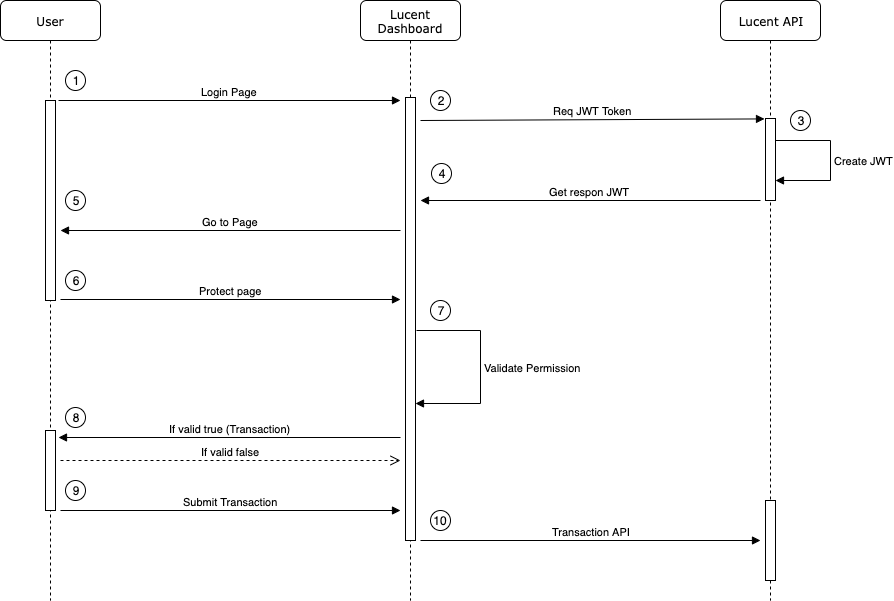
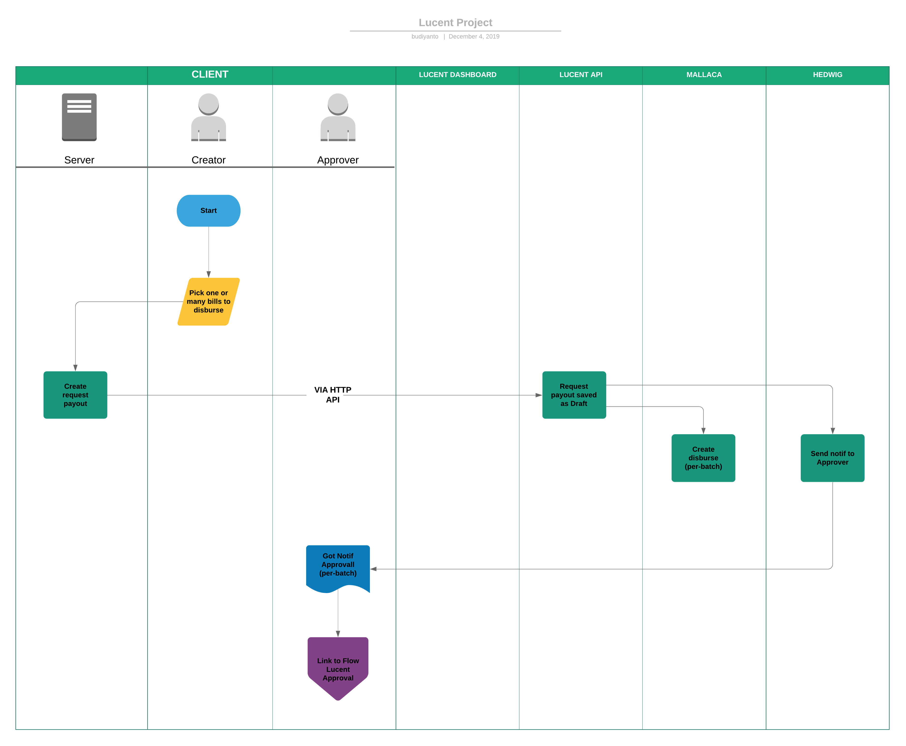

= Flow and Wireframe Lucent

Berikut merupakan _flow/wireframe_ dari sistem Lucent:

== Flow API Lucent

 

Berikut langkah - langkah dari API Lucent:

. User login into login page Lucent dashboard
. Lucent dashboard request jwt token
. Lucent API create JWT
. Lucent sent response JWT to Lucent dashboard
. Dashboard sent back to go to page
. Get protect page
. Validate permission for Lucent dashboard
. If valid true or false transaction
. Submit transaction for Lucent dasboard
. Lucent dashboard sent transaction for Lucent API

== Flow Lucent Request

Berikut langkah - langkah dari _General Flow Lucent Request_:

. Creator finance makes the registration of bills
. Will do ceklist bills per payment term for payment
. Choose some invoice to disburse
. Create request payout
. Request payout save in lucent API
. Create disburse per batch in mallaca
. Sent notif an approver via hedwig
. Notif sent a link to an approver

== Flow Lucent Approve

Berikut langkah - langkah dari _General Flow Approal Lucent_:

. An approver logged on to the dashboard.
. To approve page.
. Pick a few will approve.
. Select all or reject.
. An approver would ask for OTP.
. An approver sent OTP.
. If in reject reject notification for them will be.
. Get that which had been shipped OTP.
. An approver otp input in the validation page.
. OTP validation and confirming the payment of.
. In the process of disburse.
. Get callback from disburse.
. Get callback in server proceed to implement the payment of success or failed.
