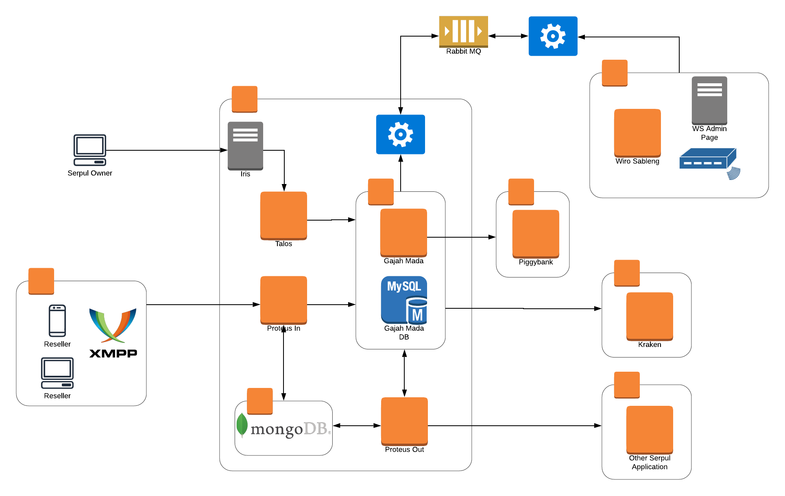

= Arsitektur Sistem Proteus Out

== High Level Architecture Proteus Out

Berikut adalah gambar dari _High Level Architecture_ dan _Web Service_ dari sistem Proteus Out:

== Related System

|===
| Related System | Description

| Gajah Mada (Pymin)
| Sistem _backend / middleware_ untuk Yapulsa v2 (API & DB)
|===
